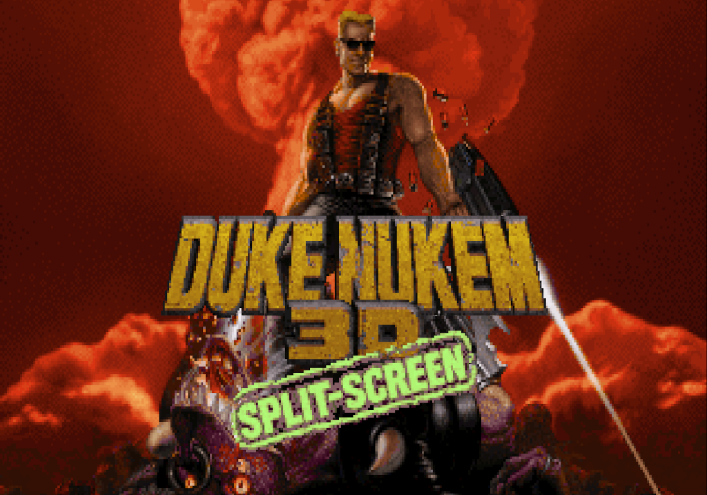

# EDuke32 Split-Screen

Fork of EDuke32 adding native 2-4 player split-screen support for Duke Nukem 3D.

  

This project is maintained by **Ranitado**. It is based on EDuke32, whose official upstream repository is:

https://voidpoint.io/terminx/eduke32

## What This Adds

- Native local split-screen for 2, 3, and 4 players.
- Gamepad-focused local multiplayer, with per-player controller and player setup.
- Cooperative save/load support.
- Optional Extra Content support for Duke Caribbean, Duke It Out in D.C., and Nuclear Winter when the user provides the required legal addon files.
- Various general adjustments to improve the overall experience in both single-player and split-screen co-op.

## Requirements

- Windows x64.
- A legal copy of Duke Nukem 3D.
- The original game data file, usually named `DUKE3D.GRP`.
- One gamepad per split-screen player, unless keyboard/mouse is used for player 1.

This repository and its releases do **not** include `DUKE3D.GRP` or any commercial Duke Nukem 3D game data.

Optional Extra Content packs also require the user to provide their own legal addon files. They are not included in this repository or in release downloads.

## Installing the Windows Release

1. Download `eduke32-split-screen-v0.4-windows-x64.zip` from the GitHub release.
2. Extract it to a new folder.
3. Copy your legal `DUKE3D.GRP` into that same folder.
4. Run `eduke32-split-screen.exe`.

Do not copy old `eduke32.cfg` files into the release folder unless you want to keep existing settings. For the intended default controls, start with a fresh config.

## Controls

Default keyboard/mouse controls for player 1 use a modern FPS-style layout:

- Move: `W`, `A`, `S`, `D`
- Aim: mouse
- Fire: left mouse button
- Open/use: `E`
- Jump: `Space`
- Crouch: `Ctrl`

Default gamepad controls use an Xbox-style layout:

- Move: left stick
- Aim: right stick
- Jump: `A`
- Menu/select: `Start` / `A`
- Back: `B`
- Fire: right trigger

Controls can be changed from the in-game menus. Player 1 settings are available from the main options menu. Players 2-4 can open their own in-game setup menu with `Start`.

## Split-Screen Notes

- Cooperative and DukeMatch are intended for local split-screen.
- The `Separate KB/M pads` option makes keyboard/mouse player 1 and gamepads control the remaining players.
- Savegames show the player count and support split-screen cooperative sessions.

## Legal

EDuke32 and this fork are distributed under the GNU General Public License version 2. See `LICENSE`.

Duke Nukem 3D is a commercial game. This project does not grant rights to the original game data, artwork, sounds, maps, or trademarks. You need your own legal copy of Duke Nukem 3D to play.

## Building

The Windows x64 project is located under `platform/Windows`. The release builds are produced with Visual Studio 2022 using the `Release|x64` configuration.

## Upstream

This is a source fork of EDuke32, but the GitHub repository is not a GitHub visual fork because the official upstream is hosted on Voidpoint:

https://voidpoint.io/terminx/eduke32
